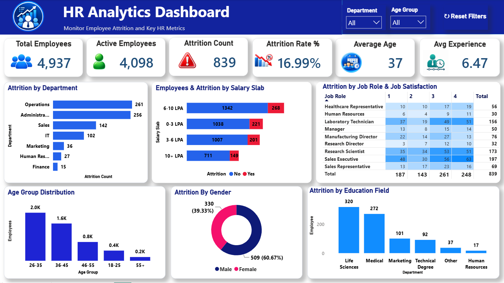
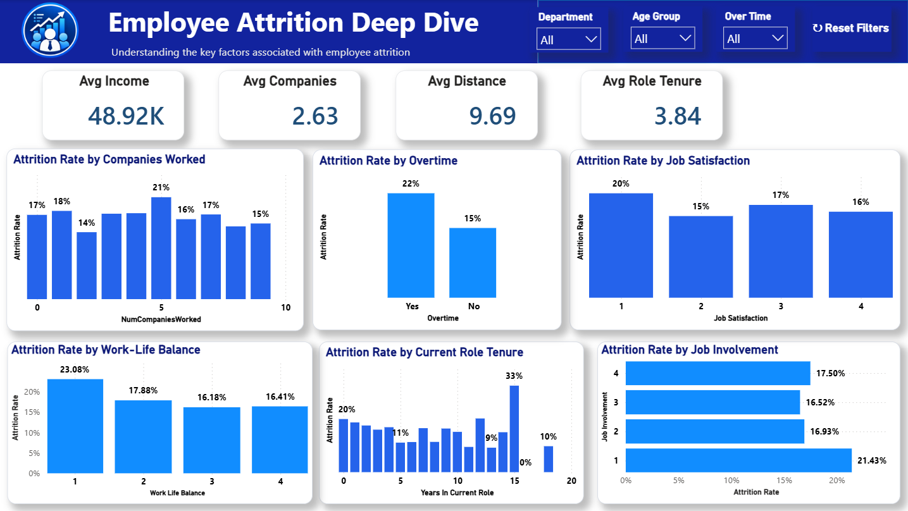

# 📊 HR Analytics Dashboard | Power BI

An interactive **HR Analytics Dashboard** developed using **Microsoft Power BI** to analyze employee attrition, workforce demographics, job roles, salary levels, job satisfaction, and other key HR metrics.

This project demonstrates practical skills in **data cleaning, data transformation, Power Query, DAX, data visualization, KPI development, and interactive dashboard design**.

---

## 📸 Dashboard Preview

### Page 1 — HR Analytics Dashboard

The overview page provides a consolidated view of workforce composition and employee attrition through key performance indicators and interactive visualizations.

It covers:

- Overall employee and attrition KPIs
- Department-wise attrition
- Salary slab analysis
- Age group distribution
- Gender-wise attrition
- Education field analysis
- Job role and satisfaction analysis

---

### Page 2 — Employee Attrition Deep Dive

The deep-dive page provides a more detailed analysis of factors associated with employee attrition.

It covers:

- Attrition by number of companies worked
- Attrition by overtime
- Attrition by job satisfaction
- Attrition by work-life balance
- Attrition by current role tenure
- Attrition by job involvement

---

## 🎯 Project Objective

The objective of this project is to transform raw HR data into an interactive **Business Intelligence dashboard** that helps HR teams and business stakeholders explore employee attrition patterns and workforce characteristics.

The dashboard enables users to analyze:

- Employee attrition
- Department-wise workforce distribution
- Salary slab-wise attrition
- Age group patterns
- Gender-wise attrition
- Job role distribution
- Job satisfaction
- Overtime
- Work-life balance
- Current role tenure
- Job involvement
- Number of companies worked

---

## 📌 Key KPIs

| KPI | Value |
|---|---:|
| 👥 Total Employees | **4,937** |
| 🟢 Active Employees | **4,098** |
| 🔴 Attrition Count | **839** |
| 📉 Attrition Rate | **16.99%** |
| 🎂 Average Age | **37** |
| 💼 Average Experience | **6.47 Years** |

### Additional Metrics

| Metric | Value |
|---|---:|
| 💰 Average Income | **48.92K** |
| 🏢 Average Companies Worked | **2.63** |
| 📍 Average Distance | **9.69** |
| 💼 Average Role Tenure | **3.84 Years** |

---

## 📊 Dashboard Features

### 1. Workforce Overview

The first dashboard page provides a high-level overview of the organization's workforce.

Key analysis includes:

- Total employees
- Active employees
- Attrition count
- Attrition rate
- Average age
- Average experience
- Department-wise attrition
- Salary slab distribution
- Age group distribution
- Gender-wise attrition
- Education field analysis

---

### 2. Employee Attrition Analysis

The second dashboard page provides a detailed analysis of employee attrition across multiple workforce and workplace factors.

The analysis includes:

- Attrition by number of companies worked
- Attrition by overtime
- Attrition by job satisfaction
- Attrition by work-life balance
- Attrition by current role tenure
- Attrition by job involvement

---

### 3. Job Role & Satisfaction Analysis

The dashboard provides analysis of employee attrition across different job roles and satisfaction levels.

This includes:

- Job role-wise employee distribution
- Job satisfaction levels
- Attrition across satisfaction categories
- Job role and satisfaction comparison
- Department-wise attrition patterns

---

### 4. Salary Slab Analysis

Employees are analyzed across different salary slabs to understand workforce distribution and attrition patterns.

Salary categories include:

- 0–3 LPA
- 3–6 LPA
- 6–10 LPA
- 10+ LPA

The dashboard provides a comparison of employee distribution and attrition across these salary categories.

---

### 5. Demographic Analysis

The dashboard provides workforce analysis across multiple demographic dimensions:

- Age groups
- Gender
- Education fields
- Departments
- Job roles

This helps provide a broader understanding of workforce composition and employee attrition patterns.

---

### 6. Interactive Filters

The dashboard includes interactive filters that allow users to dynamically explore different workforce segments.

Available filters include:

- **Department**
- **Age Group**
- **Over Time** *(Deep Dive page)*

These filters allow users to drill down into specific employee groups and analyze attrition patterns interactively.

---

## 🧹 Data Cleaning & Transformation

The raw HR dataset was imported from **Microsoft Excel into Power BI**, where data cleaning and transformation were performed using **Power Query**.

The data preparation process included:

- Promoting headers
- Removing unnecessary rows
- Changing and validating data types
- Sorting records
- Removing duplicate records
- Filtering rows
- Replacing values where required
- Creating a conditional `AttritionCount` column

### AttritionCount

A conditional column was created to convert employee attrition status into a numeric indicator:

    If Attrition = "Yes" → 1
    If Attrition = "No"  → 0

This numeric indicator was used to support attrition calculations and visualizations within the Power BI dashboard.

---

## 🧮 DAX & KPI Calculations

DAX measures were used to calculate key HR metrics and support interactive analysis.

The dashboard includes calculations for:

- Total Employees
- Active Employees
- Attrition Count
- Attrition Rate
- Average Age
- Average Experience
- Average Income
- Average Companies Worked
- Average Distance
- Average Role Tenure

These measures allow the dashboard to dynamically respond to user-selected filters.

---

## 📂 Project Structure

    HR_Analytics_PowerBI/
    │
    ├── Dashboard/
    │   └── HR_Analytics_Dashboard.pbix
    │
    ├── Dataset/
    │   └── HR_Analytics_Raw.xlsx
    │
    ├── Documentation/
    │   └── Data_Cleaning_and_Transformation.md
    │
    ├── Screenshots/
    │   ├── Overview.png
    │   └── Attrition_Deep_Dive.png
    │
    └── README.md

### 📁 File & Folder Description

| File / Folder | Description |
|---|---|
| `Dashboard/` | Contains the Power BI dashboard file |
| `Dataset/` | Contains the raw HR dataset |
| `Documentation/` | Contains detailed data cleaning and transformation documentation |
| `Screenshots/` | Contains dashboard preview images |
| `README.md` | Project overview and documentation |

---

## 💡 Key Analytical Areas

The dashboard can be used to explore employee attrition across different workforce, job, and workplace factors.

### Workforce Factors

- Department
- Age group
- Gender
- Education field
- Salary slab

### Job Factors

- Job role
- Job satisfaction
- Job involvement
- Current role tenure
- Number of companies worked

### Workplace Factors

- Overtime
- Work-life balance
- Distance from workplace

> **Note:** The dashboard highlights patterns and relationships present in the dataset. These observations should not automatically be interpreted as causal relationships.

---

## 📈 Business Use Cases

This dashboard can support HR and business teams in exploring:

- Overall employee attrition levels
- Department-wise attrition patterns
- Salary-wise employee attrition
- Workforce age distribution
- Gender-wise attrition
- Job role and satisfaction patterns
- Overtime-related attrition patterns
- Work-life balance patterns
- Employee role tenure
- Job involvement and attrition
- Workforce distribution across departments

The interactive filters allow users to perform targeted analysis across different employee segments.

---

## 🛠️ Tools & Technologies

| Technology | Purpose |
|---|---|
| **Microsoft Power BI** | Dashboard development and data visualization |
| **Power Query** | Data cleaning and transformation |
| **DAX** | Measures, KPIs, and analytical calculations |
| **Microsoft Excel** | Raw data source |

---

## 🚀 Skills Demonstrated

This project demonstrates practical skills in:

- **Data Cleaning & Transformation**
- **Power Query**
- **DAX**
- **Data Visualization**
- **KPI Development**
- **Dashboard Development**
- **HR Analytics**
- **Business Intelligence**
- **Interactive Reporting**
- **Data-driven Analysis**
- **Microsoft Excel**
- **Power BI**

---

## 📚 Documentation

Detailed documentation for the Power Query data cleaning and transformation process is available here:

[Data Cleaning & Transformation](Documentation/Data_Cleaning_and_Transformation.md)

---

## 👤 Author

### Shubhangi Desai

**Data Analyst | Power BI | SQL | Excel | Data Analytics**

